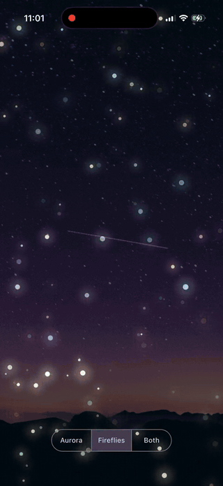

# Wellness Visualizer

Audio-reactive ambient scenes in Flutter — shader and particle visualizers that
breathe with the music, layered over a track's theme artwork.

<p align="center">
  
</p>

_Recorded on a physical iPhone. Full-quality video: [`public/recording.mp4`](public/recording.mp4)_

## Scenes

| Mode          | Technique                                                                  | Audio mapping                                                          |
| ------------- | -------------------------------------------------------------------------- | ---------------------------------------------------------------------- |
| **Aurora**    | `FragmentShader` — three layers of FBM noise curtains, teal→violet palette | bass → curtain width & reach, mid → brightness, treble → ripple detail |
| **Fireflies** | `CustomPainter` — ~90 particles with slow curl-noise drift                 | mid → glow, treble → twinkle, bass → subtle size swell                 |
| **Both**      | Layered with additive blending over the theme image                        | —                                                                      |

## Designed for calm

Most music visualizers are built for energy — they strobe on every beat. A
wellness app needs the opposite, and that constraint shaped three decisions:

- **Asymmetric envelope smoothing.** Band energies follow the music with a
  ~50 ms attack but a ~800 ms release, so scenes _swell_ and _settle_ rather
  than flash. The tuning lives in one place (`lib/audio/audio_engine.dart`).
- **Audio drives luminance, not motion.** Particle velocity stays constant;
  loud passages make the field glow brighter, not fly faster. Movement stays
  meditative at any volume.
- **Muted, narrow palettes.** Desaturated teal/violet for the aurora, warm
  amber/cool teal for fireflies — tuned to sit over dark artwork without
  fighting it.

## Architecture

```
flutter_soloud (playback + realtime FFT)
        │
  AudioEngine ── 256-bin FFT → bass/mid/treble/energy (smoothed Bands)
        │
   ValueNotifier<Bands> ─┬─→ aurora.frag uniforms (GPU)
   Ticker (time)         └─→ FirefliesPainter (single-pass canvas)
```

- **Zero widget rebuilds per frame.** A single `Ticker` feeds
  `ValueNotifier`s wired directly into `CustomPainter.repaint` — no
  `setState` in the render loop. Steady 60 FPS on device.
- **Cheap to scale down.** Low-end Android budget is two knobs: FBM octaves
  (5 → 3) in the shader and the particle count.
- **Extensible by pattern.** Water ripples reuse the aurora shader structure
  with a radial distance field; constellations are the firefly painter plus
  proximity lines; sacred geometry is the same shader harness in polar
  coordinates.

## Running

```bash
flutter pub get
flutter run  # assets (ambient track + theme image) are included
```

## License

MIT — © Andrew Dongmin Yoo
